# RDMA Completion Processing Modes - Sequence Diagrams

This document provides sequence diagrams for the various RDMA completion processing modes documented in [RDMA_COMPLETION_MODES.md](./RDMA_COMPLETION_MODES.md).

---

## Mode 1: Per-CPU Shared CQ with Interrupt+Polling Framework (dev_cq)

### Initial Interrupt and Transition to Polling

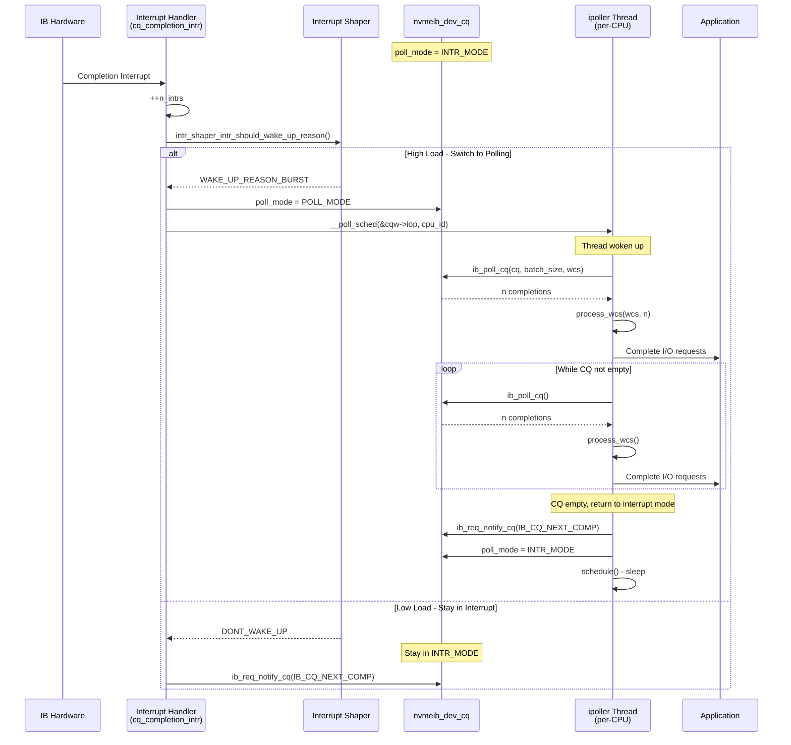
```mermaid
sequenceDiagram
    participant HW as IB Hardware
    participant INT as Interrupt Handler<br/>(cq_completion_intr)
    participant SHAPER as Interrupt Shaper
    participant CQ as nvmeib_dev_cq
    participant IPOLLER as ipoller Thread<br/>(per-CPU)
    participant APP as Application

    Note over CQ: poll_mode = INTR_MODE
    
    HW->>INT: Completion Interrupt
    INT->>INT: ++n_intrs
    INT->>SHAPER: intr_shaper_intr_should_wake_up_reason()
    
    alt High Load - Switch to Polling
        SHAPER-->>INT: WAKE_UP_REASON_BURST
        INT->>CQ: poll_mode = POLL_MODE
        INT->>IPOLLER: __poll_sched(&cqw->iop, cpu_id)
        Note over IPOLLER: Thread woken up
        
        IPOLLER->>CQ: ib_poll_cq(cq, batch_size, wcs)
        CQ-->>IPOLLER: n completions
        IPOLLER->>IPOLLER: process_wcs(wcs, n)
        IPOLLER->>APP: Complete I/O requests
        
        loop While CQ not empty
            IPOLLER->>CQ: ib_poll_cq()
            CQ-->>IPOLLER: n completions
            IPOLLER->>IPOLLER: process_wcs()
            IPOLLER->>APP: Complete I/O requests
        end
        
        Note over IPOLLER: CQ empty, return to interrupt mode
        IPOLLER->>CQ: ib_req_notify_cq(IB_CQ_NEXT_COMP)
        IPOLLER->>CQ: poll_mode = INTR_MODE
        IPOLLER->>IPOLLER: schedule() - sleep
        
    else Low Load - Stay in Interrupt
        SHAPER-->>INT: DONT_WAKE_UP
        Note over CQ: Stay in INTR_MODE
        INT->>CQ: ib_req_notify_cq(IB_CQ_NEXT_COMP)
    end
```

### User-Space Polling Mode (SPDK Integration)

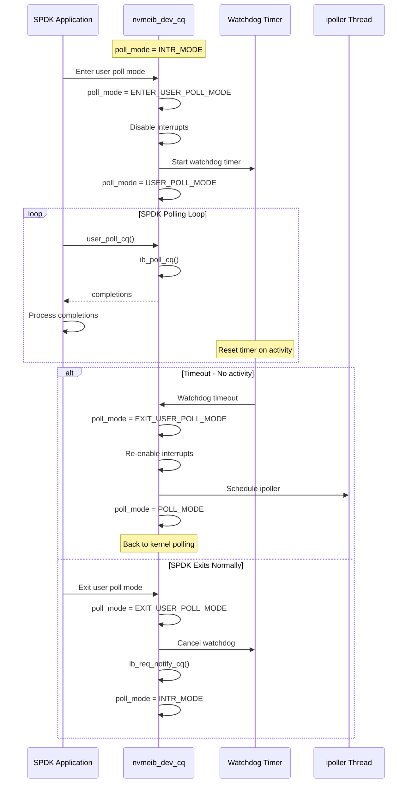
```mermaid
sequenceDiagram
    participant SPDK as SPDK Application
    participant CQ as nvmeib_dev_cq
    participant TIMER as Watchdog Timer
    participant IPOLLER as ipoller Thread

    Note over CQ: poll_mode = INTR_MODE
    
    SPDK->>CQ: Enter user poll mode
    CQ->>CQ: poll_mode = ENTER_USER_POLL_MODE
    CQ->>CQ: Disable interrupts
    CQ->>TIMER: Start watchdog timer
    CQ->>CQ: poll_mode = USER_POLL_MODE
    
    loop SPDK Polling Loop
        SPDK->>CQ: user_poll_cq()
        CQ->>CQ: ib_poll_cq()
        CQ-->>SPDK: completions
        SPDK->>SPDK: Process completions
        Note over TIMER: Reset timer on activity
    end
    
    alt Timeout - No activity
        TIMER->>CQ: Watchdog timeout
        CQ->>CQ: poll_mode = EXIT_USER_POLL_MODE
        CQ->>CQ: Re-enable interrupts
        CQ->>IPOLLER: Schedule ipoller
        CQ->>CQ: poll_mode = POLL_MODE
        Note over CQ: Back to kernel polling
    else SPDK Exits Normally
        SPDK->>CQ: Exit user poll mode
        CQ->>CQ: poll_mode = EXIT_USER_POLL_MODE
        CQ->>TIMER: Cancel watchdog
        CQ->>CQ: ib_req_notify_cq()
        CQ->>CQ: poll_mode = INTR_MODE
    end
```

---

## Mode 2: Private CQ with Dedicated Kthread

### Receive CQ Processing

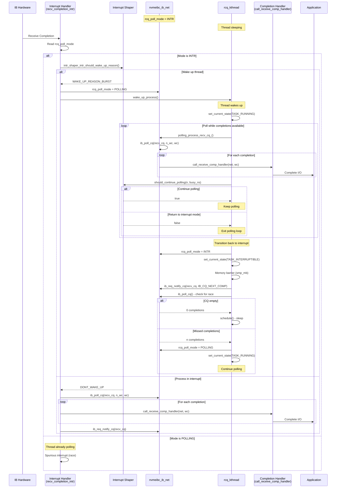
```mermaid
sequenceDiagram
    participant HW as IB Hardware
    participant INT as Interrupt Handler<br/>(recv_completion_intr)
    participant SHAPER as Interrupt Shaper
    participant NET as nvmeibc_ib_net
    participant KTHREAD as rcq_kthread
    participant HANDLER as Completion Handler<br/>(call_receive_comp_handler)
    participant APP as Application

    Note over NET: rcq_poll_mode = INTR
    Note over KTHREAD: Thread sleeping
    
    HW->>INT: Receive Completion
    INT->>INT: Read rcq_poll_mode
    
    alt Mode is INTR
        INT->>SHAPER: intr_shaper_intr_should_wake_up_reason()
        
        alt Wake up thread
            SHAPER-->>INT: WAKE_UP_REASON_BURST
            INT->>NET: rcq_poll_mode = POLLING
            INT->>KTHREAD: wake_up_process()
            
            Note over KTHREAD: Thread wakes up
            KTHREAD->>KTHREAD: set_current_state(TASK_RUNNING)
            
            loop Poll while completions available
                KTHREAD->>NET: polling_process_recv_cq_()
                NET->>NET: ib_poll_cq(recv_cq, n_wc, wc)
                
                loop For each completion
                    NET->>HANDLER: call_receive_comp_handler(net, wc)
                    HANDLER->>APP: Complete I/O
                end
                
                KTHREAD->>SHAPER: should_continue_polling(n, busy_ns)
                alt Continue polling
                    SHAPER-->>KTHREAD: true
                    Note over KTHREAD: Keep polling
                else Return to interrupt mode
                    SHAPER-->>KTHREAD: false
                    Note over KTHREAD: Exit polling loop
                end
            end
            
            Note over KTHREAD: Transition back to interrupt
            KTHREAD->>NET: rcq_poll_mode = INTR
            KTHREAD->>KTHREAD: set_current_state(TASK_INTERRUPTIBLE)
            KTHREAD->>KTHREAD: Memory barrier (smp_mb)
            KTHREAD->>NET: ib_req_notify_cq(recv_cq, IB_CQ_NEXT_COMP)
            KTHREAD->>NET: ib_poll_cq() - check for race
            
            alt CQ empty
                NET-->>KTHREAD: 0 completions
                KTHREAD->>KTHREAD: schedule() - sleep
            else Missed completions
                NET-->>KTHREAD: n completions
                KTHREAD->>NET: rcq_poll_mode = POLLING
                KTHREAD->>KTHREAD: set_current_state(TASK_RUNNING)
                Note over KTHREAD: Continue polling
            end
            
        else Process in interrupt
            SHAPER-->>INT: DONT_WAKE_UP
            INT->>NET: ib_poll_cq(recv_cq, n_wc, wc)
            loop For each completion
                INT->>HANDLER: call_receive_comp_handler(net, wc)
                HANDLER->>APP: Complete I/O
            end
            INT->>NET: ib_req_notify_cq(recv_cq)
        end
        
    else Mode is POLLING
        Note over INT: Thread already polling
        INT->>INT: Spurious interrupt (race)
    end
```

### Send CQ Processing with CPU Binding

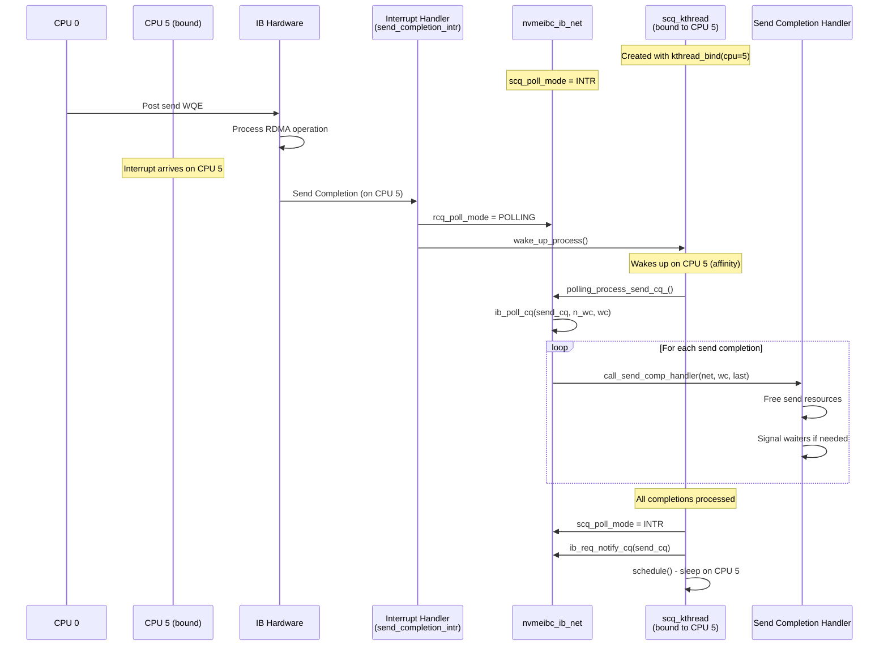
```mermaid
sequenceDiagram
    participant CPU0 as CPU 0
    participant CPU5 as CPU 5 (bound)
    participant HW as IB Hardware
    participant INT as Interrupt Handler<br/>(send_completion_intr)
    participant NET as nvmeibc_ib_net
    participant KTHREAD as scq_kthread<br/>(bound to CPU 5)
    participant HANDLER as Send Completion Handler

    Note over KTHREAD: Created with kthread_bind(cpu=5)
    Note over NET: scq_poll_mode = INTR
    
    CPU0->>HW: Post send WQE
    HW->>HW: Process RDMA operation
    
    Note over CPU5: Interrupt arrives on CPU 5
    HW->>INT: Send Completion (on CPU 5)
    INT->>NET: rcq_poll_mode = POLLING
    INT->>KTHREAD: wake_up_process()
    
    Note over KTHREAD: Wakes up on CPU 5 (affinity)
    KTHREAD->>NET: polling_process_send_cq_()
    NET->>NET: ib_poll_cq(send_cq, n_wc, wc)
    
    loop For each send completion
        NET->>HANDLER: call_send_comp_handler(net, wc, last)
        HANDLER->>HANDLER: Free send resources
        HANDLER->>HANDLER: Signal waiters if needed
    end
    
    Note over KTHREAD: All completions processed
    KTHREAD->>NET: scq_poll_mode = INTR
    KTHREAD->>NET: ib_req_notify_cq(send_cq)
    KTHREAD->>KTHREAD: schedule() - sleep on CPU 5
```

---

## Mode 3: Private CQ with Workqueue Deferral

### Interrupt to Workqueue Flow

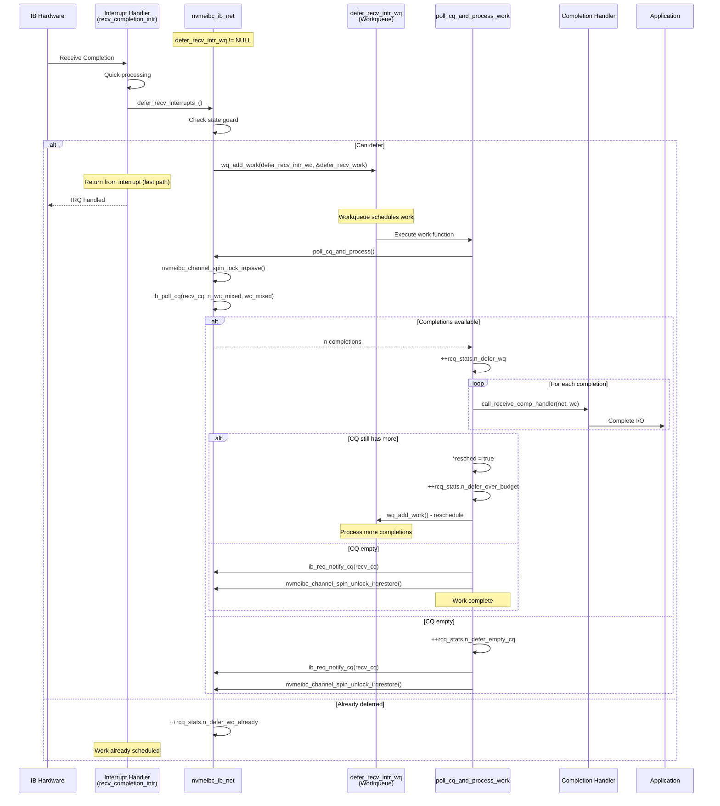
```mermaid
sequenceDiagram
    participant HW as IB Hardware
    participant INT as Interrupt Handler<br/>(recv_completion_intr)
    participant NET as nvmeibc_ib_net
    participant WQ as defer_recv_intr_wq<br/>(Workqueue)
    participant WORK as poll_cq_and_process_work
    participant HANDLER as Completion Handler
    participant APP as Application

    Note over NET: defer_recv_intr_wq != NULL
    
    HW->>INT: Receive Completion
    INT->>INT: Quick processing
    INT->>NET: defer_recv_interrupts_()
    NET->>NET: Check state guard
    
    alt Can defer
        NET->>WQ: wq_add_work(defer_recv_intr_wq, &defer_recv_work)
        Note over INT: Return from interrupt (fast path)
        INT-->>HW: IRQ handled
        
        Note over WQ: Workqueue schedules work
        WQ->>WORK: Execute work function
        
        WORK->>NET: poll_cq_and_process()
        NET->>NET: nvmeibc_channel_spin_lock_irqsave()
        NET->>NET: ib_poll_cq(recv_cq, n_wc_mixed, wc_mixed)
        
        alt Completions available
            NET-->>WORK: n completions
            WORK->>WORK: ++rcq_stats.n_defer_wq
            
            loop For each completion
                WORK->>HANDLER: call_receive_comp_handler(net, wc)
                HANDLER->>APP: Complete I/O
            end
            
            alt CQ still has more
                WORK->>WORK: *resched = true
                WORK->>WORK: ++rcq_stats.n_defer_over_budget
                WORK->>WQ: wq_add_work() - reschedule
                Note over WQ: Process more completions
            else CQ empty
                WORK->>NET: ib_req_notify_cq(recv_cq)
                WORK->>NET: nvmeibc_channel_spin_unlock_irqrestore()
                Note over WORK: Work complete
            end
            
        else CQ empty
            WORK->>WORK: ++rcq_stats.n_defer_empty_cq
            WORK->>NET: ib_req_notify_cq(recv_cq)
            WORK->>NET: nvmeibc_channel_spin_unlock_irqrestore()
        end
        
    else Already deferred
        NET->>NET: ++rcq_stats.n_defer_wq_already
        Note over INT: Work already scheduled
    end
```

### Workqueue with CPU Binding

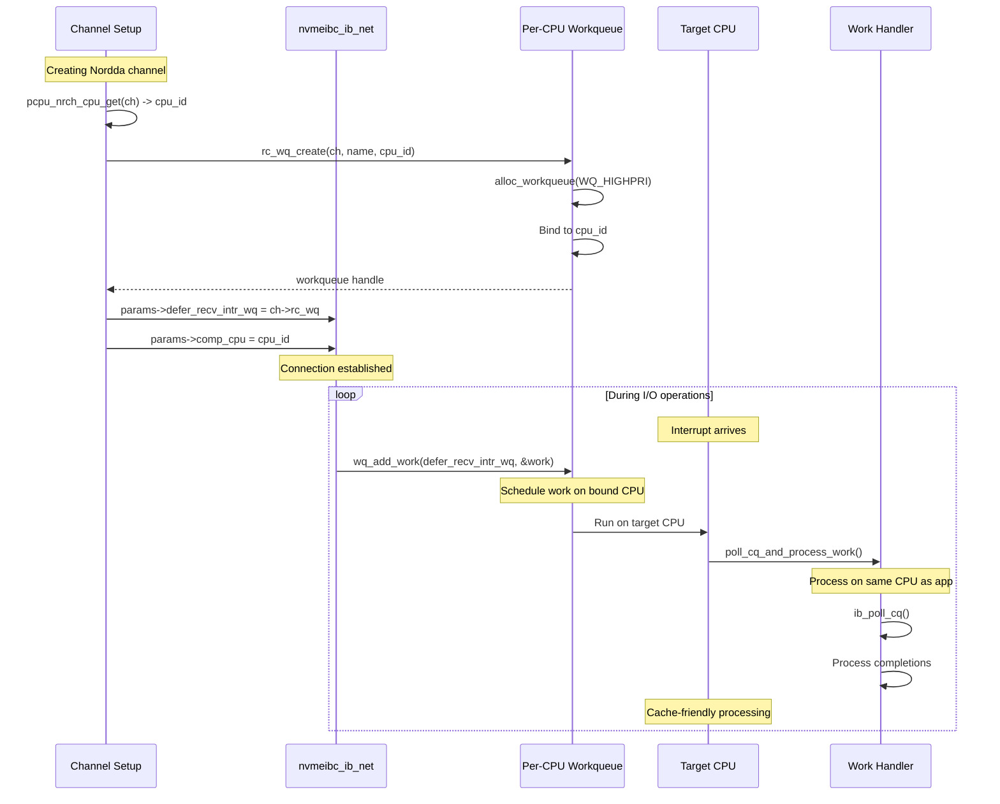
```mermaid
sequenceDiagram
    participant SETUP as Channel Setup
    participant NET as nvmeibc_ib_net
    participant WQ as Per-CPU Workqueue
    participant CPU as Target CPU
    participant WORK as Work Handler

    Note over SETUP: Creating Nordda channel
    
    SETUP->>SETUP: pcpu_nrch_cpu_get(ch) -> cpu_id
    SETUP->>WQ: rc_wq_create(ch, name, cpu_id)
    WQ->>WQ: alloc_workqueue(WQ_HIGHPRI)
    WQ->>WQ: Bind to cpu_id
    WQ-->>SETUP: workqueue handle
    
    SETUP->>NET: params->defer_recv_intr_wq = ch->rc_wq
    SETUP->>NET: params->comp_cpu = cpu_id
    
    Note over NET: Connection established
    
    loop During I/O operations
        Note over CPU: Interrupt arrives
        NET->>WQ: wq_add_work(defer_recv_intr_wq, &work)
        
        Note over WQ: Schedule work on bound CPU
        WQ->>CPU: Run on target CPU
        CPU->>WORK: poll_cq_and_process_work()
        
        Note over WORK: Process on same CPU as app
        WORK->>WORK: ib_poll_cq()
        WORK->>WORK: Process completions
        
        Note over CPU: Cache-friendly processing
    end
```

---

## Mode 4: Direct Interrupt Processing

### Simple Interrupt Path

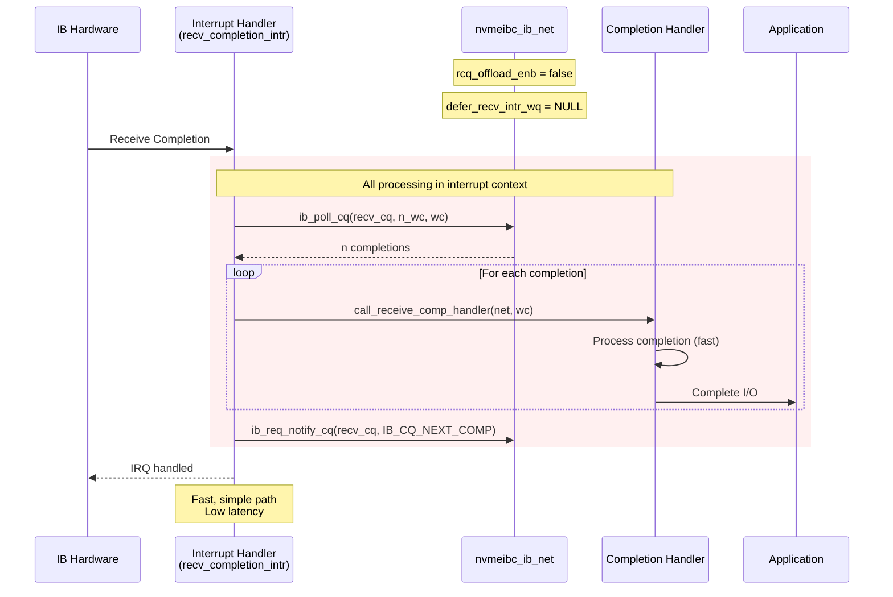
```mermaid
sequenceDiagram
    participant HW as IB Hardware
    participant INT as Interrupt Handler<br/>(recv_completion_intr)
    participant NET as nvmeibc_ib_net
    participant HANDLER as Completion Handler
    participant APP as Application

    Note over NET: rcq_offload_enb = false
    Note over NET: defer_recv_intr_wq = NULL
    
    HW->>INT: Receive Completion
    
    rect rgb(255, 240, 240)
        Note over INT,HANDLER: All processing in interrupt context
        
        INT->>NET: ib_poll_cq(recv_cq, n_wc, wc)
        NET-->>INT: n completions
        
        loop For each completion
            INT->>HANDLER: call_receive_comp_handler(net, wc)
            HANDLER->>HANDLER: Process completion (fast)
            HANDLER->>APP: Complete I/O
        end
        
        INT->>NET: ib_req_notify_cq(recv_cq, IB_CQ_NEXT_COMP)
    end
    
    INT-->>HW: IRQ handled
    
    Note over INT: Fast, simple path<br/>Low latency
```

### Interrupt with Polling Loop (Missed Event Prevention)

```mermaid
sequenceDiagram
    participant HW as IB Hardware
    participant INT as Interrupt Handler<br/>(recv_completion_intr)
    participant NET as nvmeibc_ib_net
    participant HANDLER as Completion Handler

    Note over INT: nvmeibc_max_notify_cq_iterations = 10
    
    HW->>INT: Receive Completion
    
    loop i < max_notify_cq_iterations
        INT->>NET: ib_poll_cq(recv_cq, n_wc, wc)
        
        alt Completions available
            NET-->>INT: n completions
            
            loop For each completion
                INT->>HANDLER: call_receive_comp_handler(net, wc)
            end
            
            Note over INT: Continue to next iteration
            
        else CQ empty
            NET-->>INT: 0 completions
            
            INT->>NET: ib_req_notify_cq(recv_cq, IB_CQ_NEXT_COMP)
            
            alt Re-arm successful
                NET-->>INT: Success (0)
                
                INT->>NET: ib_poll_cq() - check for race
                
                alt No new completions
                    NET-->>INT: 0
                    Note over INT: Successfully re-armed, exit
                    break
                else New completions (race)
                    NET-->>INT: n completions
                    loop Process new completions
                        INT->>HANDLER: call_receive_comp_handler(net, wc)
                    end
                    Note over INT: Continue polling loop
                end
                
            else Re-arm failed (CQ not empty)
                NET-->>INT: Non-zero
                Note over INT: CQ has more completions
                Note over INT: Continue to next iteration
            end
        end
        
        alt Reached max iterations
            Note over INT: Give up, may miss events
            INT->>INT: ++n_missed_events
            break
        end
    end
    
    INT-->>HW: IRQ handled
```

---

## Shared CQ Mode

### Combined Send and Receive CQ Processing

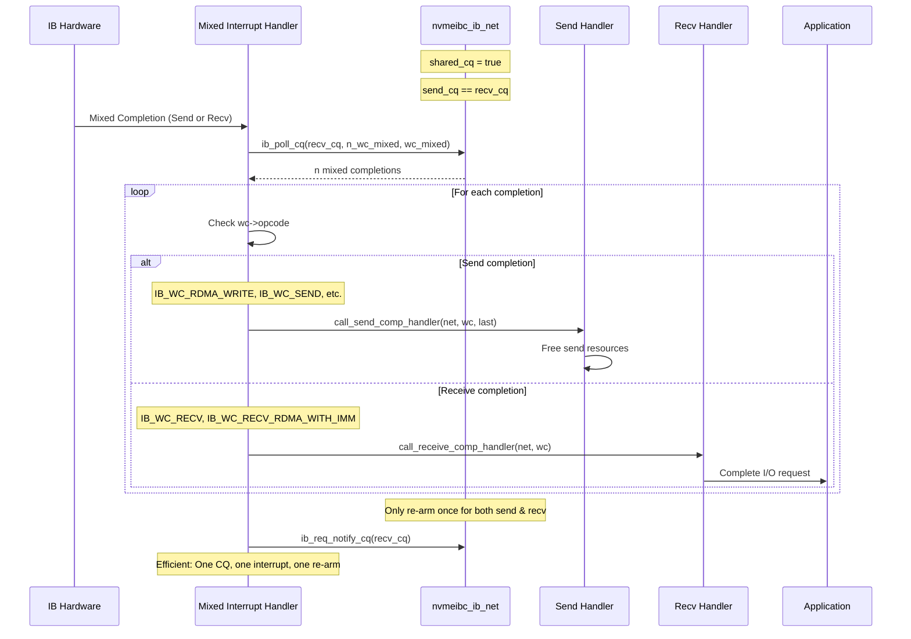
```mermaid
sequenceDiagram
    participant HW as IB Hardware
    participant INT as Mixed Interrupt Handler
    participant NET as nvmeibc_ib_net
    participant SEND_H as Send Handler
    participant RECV_H as Recv Handler
    participant APP as Application

    Note over NET: shared_cq = true
    Note over NET: send_cq == recv_cq
    
    HW->>INT: Mixed Completion (Send or Recv)
    
    INT->>NET: ib_poll_cq(recv_cq, n_wc_mixed, wc_mixed)
    NET-->>INT: n mixed completions
    
    loop For each completion
        INT->>INT: Check wc->opcode
        
        alt Send completion
            Note over INT: IB_WC_RDMA_WRITE, IB_WC_SEND, etc.
            INT->>SEND_H: call_send_comp_handler(net, wc, last)
            SEND_H->>SEND_H: Free send resources
            
        else Receive completion
            Note over INT: IB_WC_RECV, IB_WC_RECV_RDMA_WITH_IMM
            INT->>RECV_H: call_receive_comp_handler(net, wc)
            RECV_H->>APP: Complete I/O request
        end
    end
    
    Note over NET: Only re-arm once for both send & recv
    INT->>NET: ib_req_notify_cq(recv_cq)
    
    Note over INT: Efficient: One CQ, one interrupt, one re-arm
```

---

## Mode Comparison: Same Workload

### Scenario: 10 Completions Arrive

#### Mode 1: Per-CPU CQ

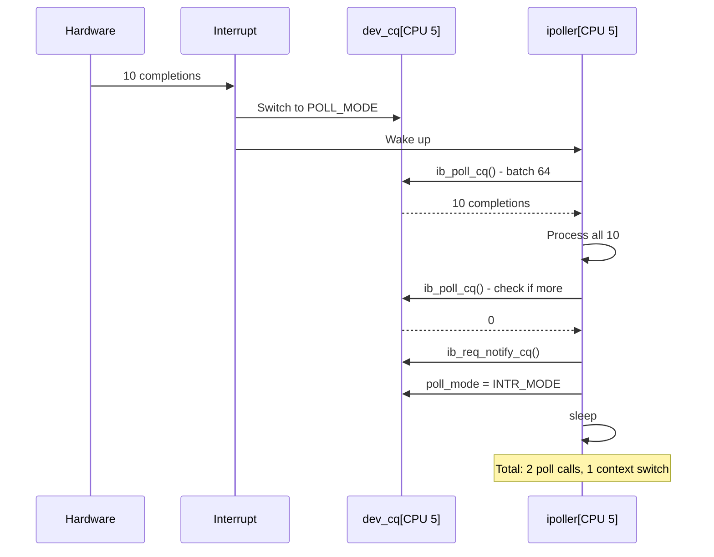
```mermaid
sequenceDiagram
    participant HW as Hardware
    participant INT as Interrupt
    participant CQ as dev_cq[CPU 5]
    participant IPOLL as ipoller[CPU 5]

    HW->>INT: 10 completions
    INT->>CQ: Switch to POLL_MODE
    INT->>IPOLL: Wake up
    
    IPOLL->>CQ: ib_poll_cq() - batch 64
    CQ-->>IPOLL: 10 completions
    IPOLL->>IPOLL: Process all 10
    
    IPOLL->>CQ: ib_poll_cq() - check if more
    CQ-->>IPOLL: 0
    
    IPOLL->>CQ: ib_req_notify_cq()
    IPOLL->>CQ: poll_mode = INTR_MODE
    IPOLL->>IPOLL: sleep
    
    Note over IPOLL: Total: 2 poll calls, 1 context switch
```

#### Mode 2: Kthread

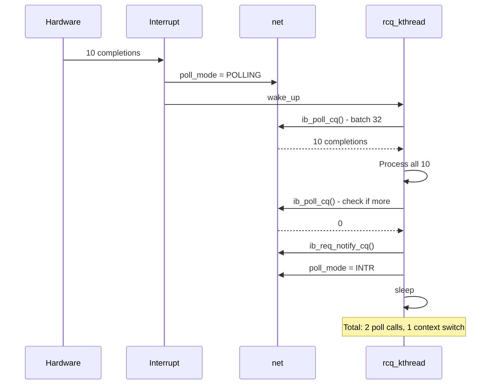
```mermaid
sequenceDiagram
    participant HW as Hardware
    participant INT as Interrupt
    participant NET as net
    participant KTHREAD as rcq_kthread

    HW->>INT: 10 completions
    INT->>NET: poll_mode = POLLING
    INT->>KTHREAD: wake_up
    
    KTHREAD->>NET: ib_poll_cq() - batch 32
    NET-->>KTHREAD: 10 completions
    KTHREAD->>KTHREAD: Process all 10
    
    KTHREAD->>NET: ib_poll_cq() - check if more
    NET-->>KTHREAD: 0
    
    KTHREAD->>NET: ib_req_notify_cq()
    KTHREAD->>NET: poll_mode = INTR
    KTHREAD->>KTHREAD: sleep
    
    Note over KTHREAD: Total: 2 poll calls, 1 context switch
```

#### Mode 3: Workqueue

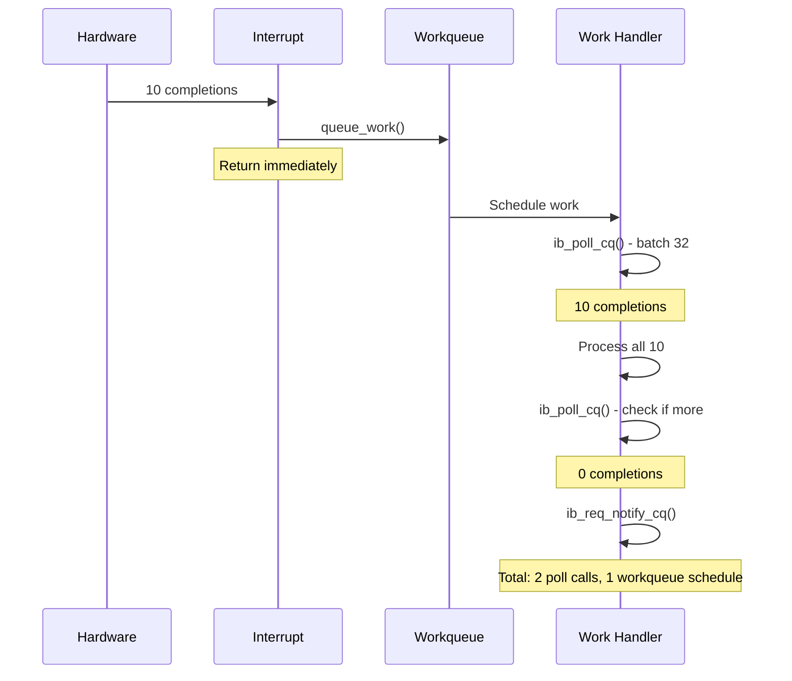
```mermaid
sequenceDiagram
    participant HW as Hardware
    participant INT as Interrupt
    participant WQ as Workqueue
    participant WORK as Work Handler

    HW->>INT: 10 completions
    INT->>WQ: queue_work()
    Note over INT: Return immediately
    
    WQ->>WORK: Schedule work
    
    WORK->>WORK: ib_poll_cq() - batch 32
    Note over WORK: 10 completions
    WORK->>WORK: Process all 10
    
    WORK->>WORK: ib_poll_cq() - check if more
    Note over WORK: 0 completions
    
    WORK->>WORK: ib_req_notify_cq()
    
    Note over WORK: Total: 2 poll calls, 1 workqueue schedule
```

#### Mode 4: Direct Interrupt

```mermaid
sequenceDiagram
    participant HW as Hardware
    participant INT as Interrupt

    HW->>INT: 10 completions
    
    rect rgb(255, 240, 240)
        Note over INT: All in interrupt context
        
        loop i=0; i<10 iterations
            INT->>INT: ib_poll_cq() - batch 1
            Note over INT: 1 completion (or more)
            INT->>INT: Process completion(s)
            
            alt CQ empty
                INT->>INT: ib_req_notify_cq()
                INT->>INT: ib_poll_cq() - race check
                
                alt No race
                    Note over INT: Done
                    break
                else Race - more completions
                    Note over INT: Continue polling
                end
            end
        end
    end
    
    Note over INT: Total: 10+ poll calls, 0 context switches<br/>All in interrupt, higher latency per completion
```

---

## QP Creation and CQ Association

### Private CQ Creation

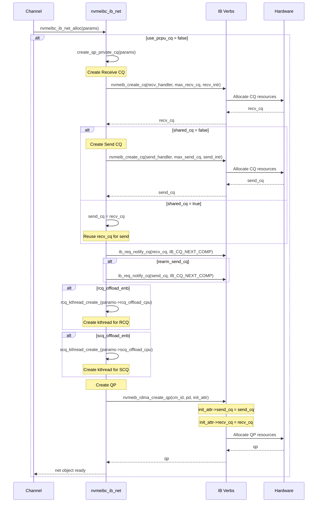
```mermaid
sequenceDiagram
    participant CH as Channel
    participant NET as nvmeibc_ib_net
    participant IB as IB Verbs
    participant HW as Hardware

    CH->>NET: nvmeibc_ib_net_alloc(params)
    
    alt use_pcpu_cq = false
        NET->>NET: create_qp_private_cq(params)
        
        Note over NET: Create Receive CQ
        NET->>IB: nvmeib_create_cq(recv_handler, max_recv_cq, recv_intr)
        IB->>HW: Allocate CQ resources
        HW-->>IB: recv_cq
        IB-->>NET: recv_cq
        
        alt shared_cq = false
            Note over NET: Create Send CQ
            NET->>IB: nvmeib_create_cq(send_handler, max_send_cq, send_intr)
            IB->>HW: Allocate CQ resources
            HW-->>IB: send_cq
            IB-->>NET: send_cq
        else shared_cq = true
            NET->>NET: send_cq = recv_cq
            Note over NET: Reuse recv_cq for send
        end
        
        NET->>IB: ib_req_notify_cq(recv_cq, IB_CQ_NEXT_COMP)
        
        alt rearm_send_cq
            NET->>IB: ib_req_notify_cq(send_cq, IB_CQ_NEXT_COMP)
        end
        
        alt rcq_offload_enb
            NET->>NET: rcq_kthread_create_(params->rcq_offload_cpu)
            Note over NET: Create kthread for RCQ
        end
        
        alt scq_offload_enb
            NET->>NET: scq_kthread_create_(params->scq_offload_cpu)
            Note over NET: Create kthread for SCQ
        end
        
        Note over NET: Create QP
        NET->>IB: nvmeib_rdma_create_qp(cm_id, pd, init_attr)
        Note over IB: init_attr->send_cq = send_cq
        Note over IB: init_attr->recv_cq = recv_cq
        IB->>HW: Allocate QP resources
        HW-->>IB: qp
        IB-->>NET: qp
        
        NET-->>CH: net object ready
    end
```

### Per-CPU CQ Association

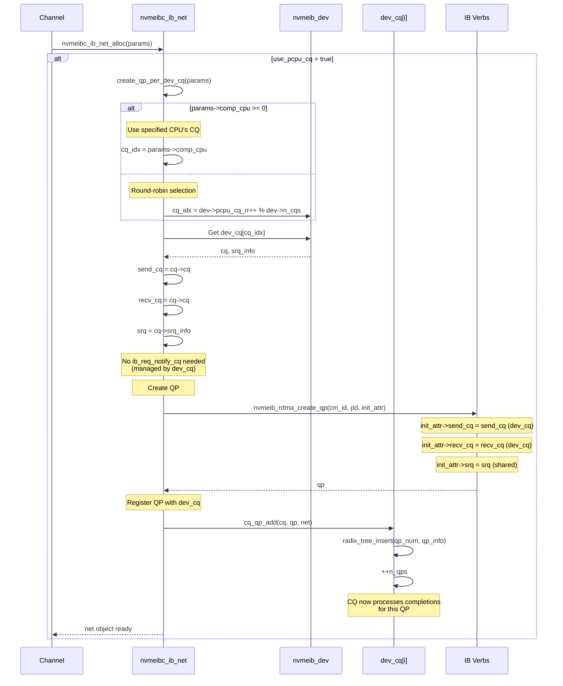
```mermaid
sequenceDiagram
    participant CH as Channel
    participant NET as nvmeibc_ib_net
    participant DEV as nvmeib_dev
    participant CQ as dev_cq[i]
    participant IB as IB Verbs

    CH->>NET: nvmeibc_ib_net_alloc(params)
    
    alt use_pcpu_cq = true
        NET->>NET: create_qp_per_dev_cq(params)
        
        alt params->comp_cpu >= 0
            Note over NET: Use specified CPU's CQ
            NET->>NET: cq_idx = params->comp_cpu
        else
            Note over NET: Round-robin selection
            NET->>DEV: cq_idx = dev->pcpu_cq_rr++ % dev->n_cqs
        end
        
        NET->>DEV: Get dev_cq[cq_idx]
        DEV-->>NET: cq, srq_info
        
        NET->>NET: send_cq = cq->cq
        NET->>NET: recv_cq = cq->cq
        NET->>NET: srq = cq->srq_info
        
        Note over NET: No ib_req_notify_cq needed<br/>(managed by dev_cq)
        
        Note over NET: Create QP
        NET->>IB: nvmeib_rdma_create_qp(cm_id, pd, init_attr)
        Note over IB: init_attr->send_cq = send_cq (dev_cq)
        Note over IB: init_attr->recv_cq = recv_cq (dev_cq)
        Note over IB: init_attr->srq = srq (shared)
        IB-->>NET: qp
        
        Note over NET: Register QP with dev_cq
        NET->>CQ: cq_qp_add(cq, qp, net)
        CQ->>CQ: radix_tree_insert(qp_num, qp_info)
        CQ->>CQ: ++n_qps
        
        Note over CQ: CQ now processes completions<br/>for this QP
        
        NET-->>CH: net object ready
    end
```

---

## Error and Teardown Flows

### QP Teardown with Private CQ

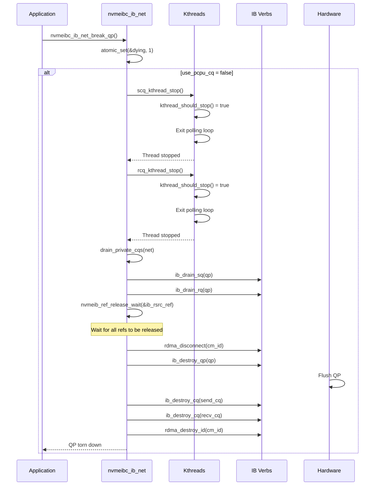
```mermaid
sequenceDiagram
    participant APP as Application
    participant NET as nvmeibc_ib_net
    participant KTHREAD as Kthreads
    participant IB as IB Verbs
    participant HW as Hardware

    APP->>NET: nvmeibc_ib_net_break_qp()
    NET->>NET: atomic_set(&dying, 1)
    
    alt use_pcpu_cq = false
        NET->>KTHREAD: scq_kthread_stop()
        KTHREAD->>KTHREAD: kthread_should_stop() = true
        KTHREAD->>KTHREAD: Exit polling loop
        KTHREAD-->>NET: Thread stopped
        
        NET->>KTHREAD: rcq_kthread_stop()
        KTHREAD->>KTHREAD: kthread_should_stop() = true
        KTHREAD->>KTHREAD: Exit polling loop
        KTHREAD-->>NET: Thread stopped
        
        NET->>NET: drain_private_cqs(net)
        NET->>IB: ib_drain_sq(qp)
        NET->>IB: ib_drain_rq(qp)
        
        NET->>NET: nvmeib_ref_release_wait(&ib_rsrc_ref)
        Note over NET: Wait for all refs to be released
        
        NET->>IB: rdma_disconnect(cm_id)
        NET->>IB: ib_destroy_qp(qp)
        HW->>HW: Flush QP
        
        NET->>IB: ib_destroy_cq(send_cq)
        NET->>IB: ib_destroy_cq(recv_cq)
        
        NET->>IB: rdma_destroy_id(cm_id)
        
        NET-->>APP: QP torn down
    end
```

### QP Teardown with Per-CPU CQ

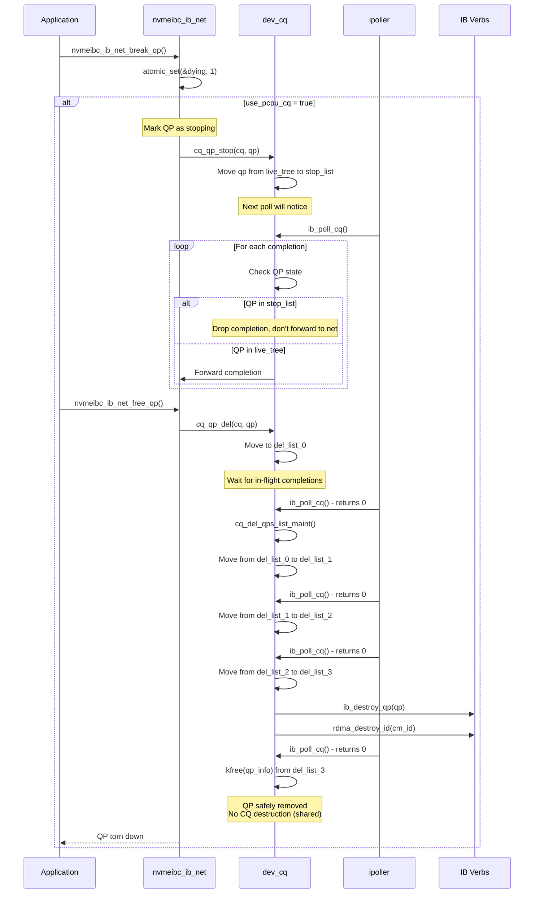
```mermaid
sequenceDiagram
    participant APP as Application
    participant NET as nvmeibc_ib_net
    participant CQ as dev_cq
    participant IPOLL as ipoller
    participant IB as IB Verbs

    APP->>NET: nvmeibc_ib_net_break_qp()
    NET->>NET: atomic_set(&dying, 1)
    
    alt use_pcpu_cq = true
        Note over NET: Mark QP as stopping
        NET->>CQ: cq_qp_stop(cq, qp)
        CQ->>CQ: Move qp from live_tree to stop_list
        
        Note over CQ: Next poll will notice
        
        IPOLL->>CQ: ib_poll_cq()
        loop For each completion
            CQ->>CQ: Check QP state
            alt QP in stop_list
                Note over CQ: Drop completion, don't forward to net
            else QP in live_tree
                CQ->>NET: Forward completion
            end
        end
        
        APP->>NET: nvmeibc_ib_net_free_qp()
        NET->>CQ: cq_qp_del(cq, qp)
        CQ->>CQ: Move to del_list_0
        Note over CQ: Wait for in-flight completions
        
        IPOLL->>CQ: ib_poll_cq() - returns 0
        CQ->>CQ: cq_del_qps_list_maint()
        CQ->>CQ: Move from del_list_0 to del_list_1
        
        IPOLL->>CQ: ib_poll_cq() - returns 0
        CQ->>CQ: Move from del_list_1 to del_list_2
        
        IPOLL->>CQ: ib_poll_cq() - returns 0
        CQ->>CQ: Move from del_list_2 to del_list_3
        CQ->>IB: ib_destroy_qp(qp)
        CQ->>IB: rdma_destroy_id(cm_id)
        
        IPOLL->>CQ: ib_poll_cq() - returns 0
        CQ->>CQ: kfree(qp_info) from del_list_3
        
        Note over CQ: QP safely removed<br/>No CQ destruction (shared)
        
        NET-->>APP: QP torn down
    end
```

---

## Performance Comparison Timeline

### Low Load: Single I/O Request

```mermaid
gantt
    title Single I/O Completion Processing (Microseconds)
    dateFormat X
    axisFormat %L
    
    section Mode 1 (dev_cq)
    Interrupt          :0, 2
    Context Switch     :2, 5
    ipoller wakeup     :5, 7
    Poll CQ            :7, 8
    Process            :8, 10
    Return to INT mode :10, 12
    Total (12µs)       :milestone, 12, 0
    
    section Mode 2 (kthread)
    Interrupt          :0, 2
    Context Switch     :2, 5
    kthread wakeup     :5, 7
    Poll CQ            :7, 8
    Process            :8, 10
    Return to INT mode :10, 12
    Total (12µs)       :milestone, 12, 0
    
    section Mode 3 (workqueue)
    Interrupt          :0, 1
    Queue work         :1, 2
    Workqueue sched    :2, 6
    Work handler       :6, 7
    Poll CQ            :7, 8
    Process            :8, 10
    Re-arm INT         :10, 11
    Total (11µs)       :milestone, 11, 0
    
    section Mode 4 (direct)
    Interrupt          :0, 1
    Poll CQ            :1, 2
    Process            :2, 4
    Re-arm INT         :4, 5
    Total (5µs)        :milestone, 5, 0
```

### High Load: 1000 Completions/Second

```mermaid
gantt
    title Burst Processing (100 completions arrive)
    dateFormat X
    axisFormat %L
    
    section Mode 1 (dev_cq)
    Interrupt          :0, 5
    Switch to POLL     :5, 10
    ipoller wakeup     :10, 15
    Poll batch 1       :15, 20
    Process 64         :20, 50
    Poll batch 2       :50, 55
    Process 36         :55, 75
    Poll check empty   :75, 80
    Return to INT      :80, 85
    Total (85µs)       :milestone, 85, 0
    
    section Mode 2 (kthread)
    Interrupt          :0, 5
    Switch to POLL     :5, 10
    kthread wakeup     :10, 15
    Poll batch 1       :15, 20
    Process 32         :20, 45
    Poll batch 2       :45, 50
    Process 32         :50, 75
    Poll batch 3       :75, 80
    Process 32         :80, 105
    Poll batch 4       :105, 110
    Process 4          :110, 115
    Return to INT      :115, 120
    Total (120µs)      :milestone, 120, 0
    
    section Mode 4 (direct INT)
    Interrupt 1-10     :0, 100
    Interrupt 11-20    :100, 200
    Interrupt 21-30    :200, 300
    ... 70 more        :300, 1000
    Total (1000µs)     :milestone, 1000, 0
```

---

## Notes

1. **Viewing These Diagrams**: 
   - GitHub/GitLab: Native Mermaid rendering
   - VS Code: Install "Markdown Preview Mermaid Support" extension
   - Command line: Use `mermaid-cli` (`mmdc`)

2. **Timing Values**: The timing values in gantt charts are approximate and for illustration purposes. Actual values depend on hardware, driver, and workload.

3. **Color Coding**: 
   - Red boxes indicate critical sections (interrupt context)
   - Notes indicate important state transitions

4. **Abbreviations**:
   - INT: Interrupt handler
   - WQ: Workqueue
   - CQ: Completion Queue
   - QP: Queue Pair
   - SRQ: Shared Receive Queue

---

**Document Version:** 1.0  
**Last Updated:** 2026-01-27  
**Companion Document:** [RDMA_COMPLETION_MODES.md](./RDMA_COMPLETION_MODES.md)

